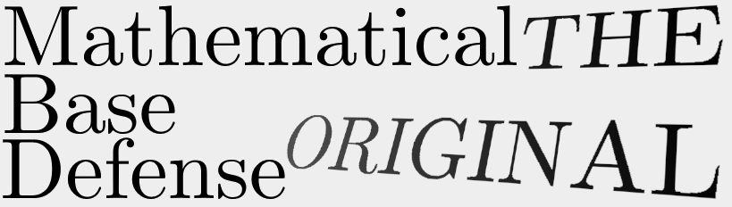

Last Updated: October 7, 2024.

  

The source code for the original version of Mathematical Base Defense, where development started on October 16, 2020 as a project for [NSTDA's](https://www.nstda.or.th/) 23rd National Software Contest!

The source code for the current versions are at [https://github.com/mathematicalbasedefenders](https://github.com/mathematicalbasedefenders), where [mistertfy64](https://github.com/mistertfy64) is currently maintaining it.

> [!NOTE]
> This was made in 2020-2021, as such, many obscure/intermediate good practices of writing software was ignored during that time. Explore at your own risk.
> 
> Regardless, the software still received THB12,000.00 in funding for passing the presentation round (but not advancing to the final round.)

 README.md text as of April 15, 2023. 

# 2023-04-15 UPDATE: Project moved to https://github.com/mathematicalbasedefenders
# 2023-04-15 CONFESSION: ok, i didnt really know what i was doing, but it passed the 2nd round in the end.
# 2023-04-15 INFORMATION: although I (@mistertfy64) came up with the idea and name, I wasn't named the leader of the NSC version project, that's why it's on a different (the actual leader's) account.

# 2023-02-23 UPDATE: THIS IS THE ORIGINAL VERSION OF MATHEMATICAL BASE DEFENDERS/DEFENSE, WHICH IS SUBMITTED TO NSTDA FOR NATIONAL SOFTWARE CONTEST 2021

# ปกป้องฐานด้วยคณิตศาสตร์: จุดกำเนิด - Mathematical Base Defense: Origin

#~~ PROJECT HAS MOVED TO https://github.com/mistertfy64/mathematicalbasedefenders~~

Mathematical Base Defense is a educational game about making math equations to destroy enemies while protecting your base in the process.

Anyone is open to contribute to Mathematical Base Defense. (you might also be rewarded)!

NOTICE: This project is a submission to NSC 2021, which is ran by the National Science and Technology Development Agency (NSTDA).

## Installation

Download the files, and then run the executable INSIDE THE FOLDER IT'S IN (you only have to do this for each first launch for each version).

## Use

You are to form expressions that match atleast one of the numbers above the enemies before they reach your base.
Doing so awards you points, the number of points according to how far the enemy is from the base, and how long your expression is.

## License

License Agreement

This software is a work developed by [Chaiyanant Cheerasiri](https://github.com/KG07), [Tinnaphop Choonchuachan](https://github.com/mistertfy64) and [Supanut Udompataikul](https://github.com/Muq1937) from
[Bangkok Christian College](https://bcc.ac.th) under the provision of Lojruthai Jocknoi under Mathematical Base Defense , which has been supported by the National Science and Technology
Development Agency (NSTDA), in order to encourage pupils and students to learn
and practice their skills in developing software. Therefore, the intellectual
property of this software shall belong to the developer and the developer gives
NSTDA a permission to distribute this software as an “as is ” and non-modified
software for a temporary and non-exclusive use without remuneration to anyone
for his or her own purpose or academic purpose, which are not commercial
purposes. In this connection, NSTDA shall not be responsible to the user for
taking care, maintaining, training or developing the efficiency of this software.
Moreover, NSTDA shall not be liable for any error, software efficiency and
damages in connection with or arising out of the use of the software.”

(copied and pasted)

## Special Thanks

**บุคคลที่ระบุไว้ด้านล่างไม่ใช่ผู้พัฒนาโครงการนี้**

**PLEASE NOTE THAT THE PEOPLE HERE ARE NOT ONE OF THE DEVELOPERS OF MATHEMATICAL BASE DEFENSE!**

[Phat Lorthammakun](https://github.com/VenusClietnt) for helping us type our school's name and being Mathematical Base Defense's mascot. 

